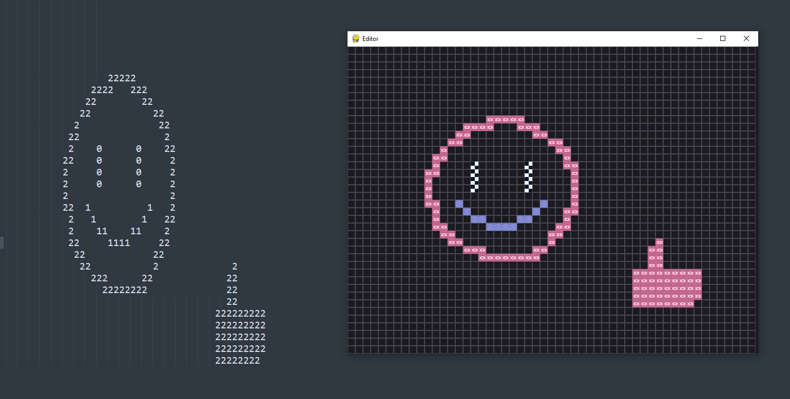

# Simple Level editor

Simple level to text file editor

# Help:
+ "1" - 1st tile type
+ "2" - 2nd tile type
+ "3" - 3rd tile type and etc.
+ "\`" - player tile
+ TAB - grid opacity
+ CTRL + S - save *\*.glf/\*.gdf*
+ CTRL + O - open *\*.glf/\*.gdf*
+ LMB - place tile
+ LMB - remove tile
> + glf - Game Level File
> + gdf - Game Decorations File
